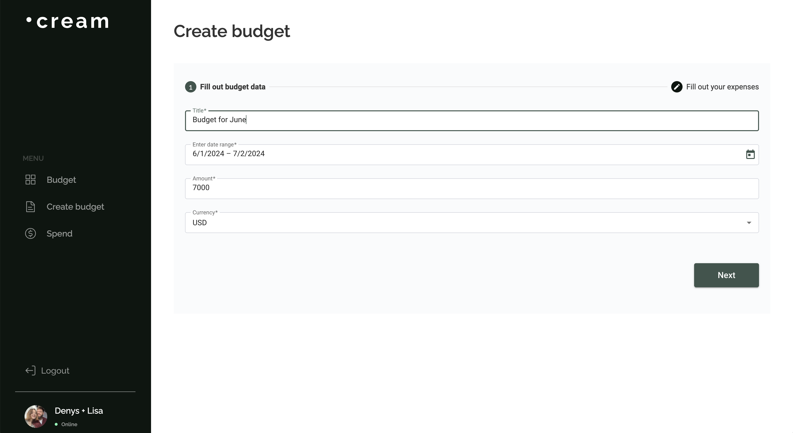
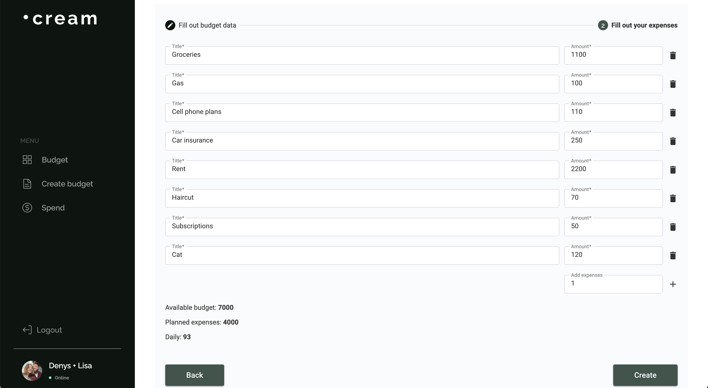
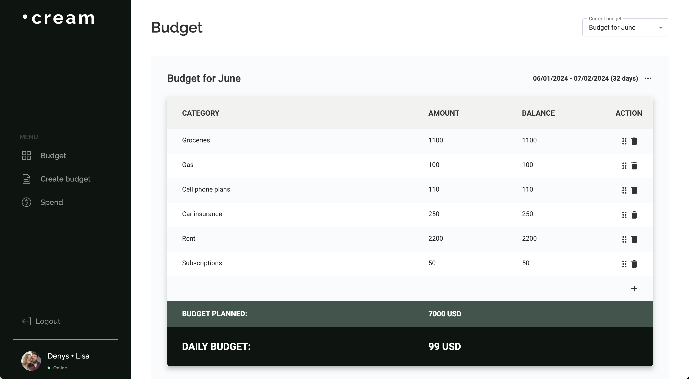
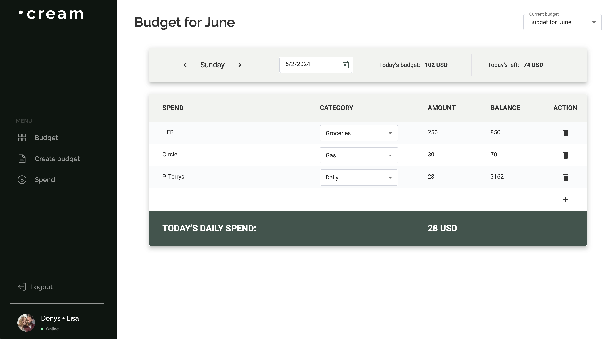

# Project Cream

> This is a project I created for personal use to track spending and plan budgets.

## Stack

- Angular
- TypeScript
- RxJS
- Firebase (Backend)
- Figma
- Angular Material
- NgRx (State Management)
- Tailwind CSS

## About

I built this Cream project so my wife and I could track our spending and plan our budgets effectively. I designed, coded, and implemented the backend using Firebase, making this a comprehensive solo project. We use this app daily to keep track of our budget.

The application features a user authentication system, allowing users to register and use the app. You can copy, delete, and edit budgets, check if the money on hand matches the budgeted amount, and track daily spending. The app also shows how much money you can spend out of your planned expenses. You can try it out yourself by visiting the link below.

Try the app here: [Cream Budget Tracker](https://cream2-7d217.web.app/)

## Screenshots

*Create budget*

*Plan expenses*

*Budget dashboard*

*Track your spendings*

Feel free to check out the code and let me know what you think!
